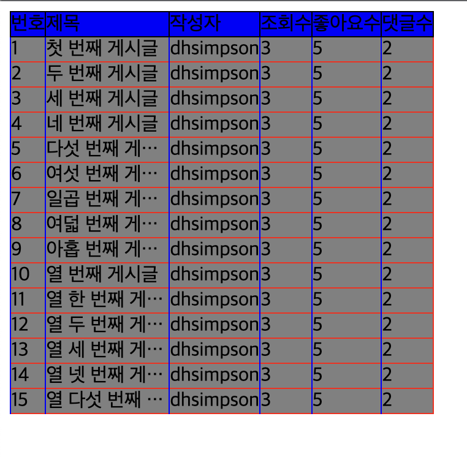

# vue-board-component

## This reusable component is bulletin board ('table' based on 'div( display: table )')
   
**for example**   


you can use ```<Board/>``` component
   

<hr/>  

## Usage

### Install
```
npm install --save vue-board-component
```
### Regist Plugin
```
import board from 'vue-board-component'

app.use(board)
```
<hr/>
<br/>

## Use Board Component

   
**You can use options for style**   


``` 
c.f.) option is class name for css    
boardHead | boardRow | headerCol | rowCol
``` 

``` 
columnList prop : head data of table   
boardList prop : list data of table what you will display.
```

### Rules when you pass columnList, boardList props
```
1. Note that you have to follow object's field name of 'columnList' (param, name, maxWidth)  
2. You have to match value of 'param' with field name of 'boardList's list item'   
```
see : [boardList.json](/src/assets/boardList.json)   
<br/>
c.f.) You'd better to watch [boardList.json](/src/assets/boardList.json) with 'columnList' in Example code

<br/>


### Example code : [exampleCode]('/src/App.vue')
```
<template>
    <div class="board-wrapper">
        <board 
        :boardHead="'board-head'" 
        :boardRow="'board-row'" 
        :headerCol="'header-col'" 
        :rowCol="'row-col'"
        :boardList="boardList" :columnList="columnList"
        />
    </div>
</template>

<script lang="ts">
import { defineComponent } from 'vue'
import Board from './components/Board.vue';
import boardList from '@/assets/boardList.json';

export default defineComponent({
  name: 'App',
  components: {Board},
  data() {
      const columnList = [
          {
              param: 'content_id',
              name: '번호',
              maxWidth: '100px'
          },
          {
              param: 'content_title',
              name: '제목',
              maxWidth: '100px'
          },
          {
              param: 'content_author',
              name: '작성자',
              maxWidth: '100px'
          },
          {
              param: 'view_count',
              name: '조회수',
              maxWidth: '100px'
          },
          {
              param: 'like_count',
              name: '좋아요수',
              maxWidth: '100px'
          },
          {
              param: 'comment_count',
              name: '댓글수',
              maxWidth: '100px'
          },
      ];
      return {
          boardList,
          columnList
        }
  }
})
</script>

<style>
.board-wrapper {
    width: 200px;
}
.board-head {
    background-color: blue;
    border: 1px solid black;
}
.board-row {
    background-color: gray;
    border: 1px solid red;
}
.header-col {
    border: 1px solid black;
}
.row-col {
    border-left: 1px solid blue;
}
</style>

```